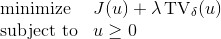
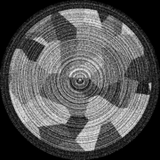
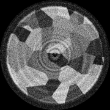
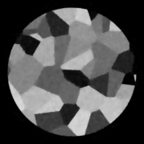
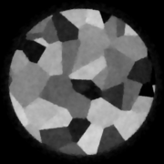
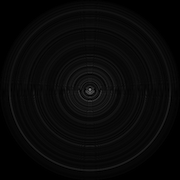
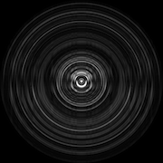
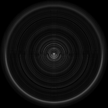

# Ring-Reduced Computed Tomography

This MATLAB package provides implementations of reconstruction models for X-ray tomographic imaging described in the paper:

> Hari Om Aggrawal, Martin S. Andersen, Sean Rose, and Emil Sidky, 
> "A Convex Reconstruction Model for X-ray tomographic Imaging with Uncertain Flat-fields", 
> submitted to *IEEE Transactions on Computational Imaging*, 2017. 
>
>  

The reconstruction models proposed in the paper are suitable when only a small number of flat-field samples are available or when the flat-field estimate is noisy or uncertain. Instead of using the maximum likelihood (ML) estimate of the flat-field in a separate approximate maximum aposteriori (MAP) reconstruction model, the proposed models (which we refer to as JMAP and SWLS) jointly estimate the attenuation image and the flat-field. In addition to these new models, the package also includes several existing reconstruction models that use the ML estimate of the flat-field. The general reconstruction model is given by

where the variable u denotes the attenuation coefficients (the image), v(u) denotes the flat-field (possibly as a function of u), and J is a convex function of u, corresponding to one of the following reconstruction models:

- `jmap` (default) — equivalent to joint MAP estimation of u and flatfield
- `swls` — solves *stripe-weighted* least-squares approximation of `jmap` using ML estimate of flat-field
- `baseline` —  solves baseline reconstruction using the true flat-field (inverse crime!)
- `amap` — solves approximate MAP estimatation problem using ML estimate of flat-field
- `wls` — solves weighted least-squares approximation of `amap` using ML estimate of flat-field

For more information about the different models, refer to the [paper](http://people.compute.dtu.dk/mskan/papers/flatfield.pdf) or read the help text included in `src/gd_recon.m`.

As demonstrated with the reconstructions below, the JMAP and SWLS models proposed in the [paper](http://people.compute.dtu.dk/mskan/papers/flatfield.pdf) can significantly reduce ring artifacts that arise because of flat-field estimation errors; refer to the paper for details about this numerical experiment.

<table style="border: none; text-align: center;">
<tr>
	<td>Baseline FBP (inverse crime)</td>
	<td>FBP</td>
	<td>Preprocessing + FBP</td>
</tr>
<tr>
  <td></td>
  <td></td>
  <td></td>
</tr>
<tr>
	<td>Baseline MAP (inverse crime)</td>
	<td>AMAP</td>
	<td>JMAP</td>
</tr>
<tr>
  <td></td>
  <td></td>
  <td></td>
</tr>
<tr>
	<td></td>
	<td>WLS</td>
	<td>SWLS</td>
</tr>
<tr>
  <td></td>
  <td></td>
  <td></td>
</tr>
</table>

In order to assess the reduction of ring artifacts in reconstructions, we proposed the "Ring Ratio" error measure in the [paper](http://people.compute.dtu.dk/mskan/papers/flatfield.pdf) which quantifies the flat-field error in the image domain. The ring images as shown below clearly demonstrates the effectiveness of the JMAP model.

<table style="border: none; text-align: center;">
<tr>
	<td>Baseline MAP (inverse crime)</td>
	<td>AMAP</td>
	<td>JMAP</td>
</tr>
<tr>
  <td></td>
  <td></td>
  <td></td>
</tr>
</table>

## Examples

The examples require the following MATLAB packages:

* [ASTRA Toolbox](http://www.astra-toolbox.com/)
* [AIR Tools](http://www.imm.dtu.dk/~pcha/AIRtools/)
* [Spot](http://www.cs.ubc.ca/labs/scl/spot/) 

## Bugs & support
Create a [new issue](https://help.github.com/articles/creating-an-issue/) or send an email to Hari Om Aggrawal ([hariom85@gmail.com](mailto:hariom85@gmail.com)).

